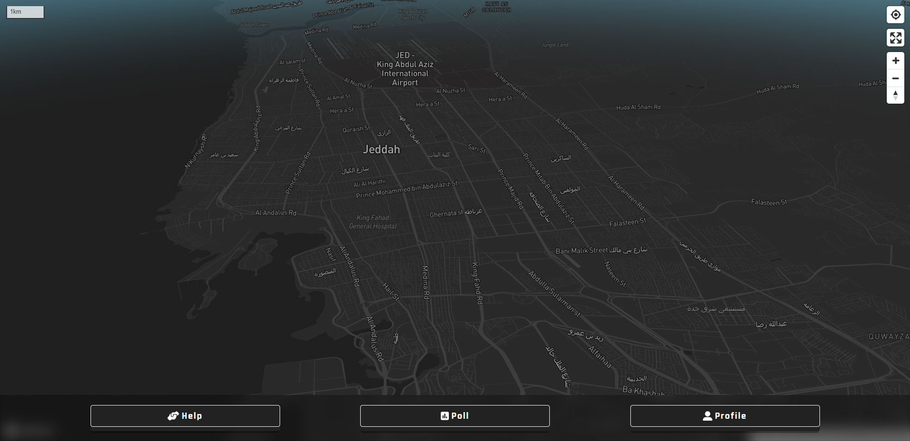

# Khatar Application - status (WIP)

> built with React, React Router, styled-components, tailwind, Mapbox, vite, vitePWA, HTML, CSS, Firebase auth, Firebase firestore, Firebase storage

---

## Table of Content

-   [Introduction](#introduction)
-   [Features](#features)
-   [Installation](#installation)
-   [Preview](#preview)
-   [Motivation](#motivation)

## Introduction

"check features for feature status"

Khatar Application is a Progressive Web Application, the idea of the application revolve around providing a tool that make its users share knowledge of danger areas via polls that other users can vote on, polls either pass or fail, if the former happened then an area should be colored that then any users who enters that area should be notified of entering a danger area, level of danger vary, it has a color-coding system that range from green (no danger), yellow, red, purple (the most dangerous). if the latter happened then no change should be reflected on the map.

The application is installable at the home-screen of your phone as it's a PWA, and it's installable via play store as an app of android platform.

The application will let you make an account via social providers (google, twitter), also it will let make and account via email and password. the application makes use of firebase auth for achieving that.

The application stores its users data in firebase firestore and firebase storage.

The application make use of React Router for client-side routing making truly SPA (single-page application), that doesn't go under the classic route of request-response cycle.

The application make use of Mapbox which is a map provider. (built on top of leaflet.js).

The application has award system, so you be able to collect awards and view them, also you can view your team awards!.

The application will let you join teams or create one! + you can chat with your team.

The application will let you make friends and chat with them.

The application will let you view the polls and help requests that you made.

The application will have a section for notifications.

The application will be configured through its settings.

The application will have dark/light theme modes.

## Features

Functional Requirements

-   Users to create accounts (Done)
-   Users to reset their account password (Done)
-   Users to switch theme mode (Dark/Light) (Done)
-   Users to delete their accounts (Done)
-   Users to sign in / out (Done)
-   Users to vote on polls (WIP)
-   Users to create polls (WIP)
-   Users to opt-in / out on receiving notifications alerts (WIP)
-   Users to opt-in / out on receiving live tracking notifications (WIP)
-   Users to opt-in / out on receiving live group notification when receiving invitation from other Users. (WIP)
-   Users to block other Users (WIP)
-   Users to add other users as friend (WIP)
-   Users to customize their profile information (WIP)
-   Users to have awards (WIP)
-   Users to send help requests to specific Users (WIP)
-   Users to create help requests on the map(WIP)
-   Users to accept / deny requests of help from other Users (WIP)
-   Users to Browse real-time a map (WIP)

Non-Functional Requirements

-   Secured using SSL/TLS encryption (HTTPS) (Done)
-   Intuitive and have user-friendly interface Web version and Mobile version (Done)
-   Progressive Web Application (Done)
-   front-end must cache the data that is send from the back-end using service workers for performance (WIP)
-   It should load quickly and efficiently, even on slow or unreliable networks speed (WIP)
-   Be available offline, or with limited connectivity using services workers (WIP)
-   Should provide seamless, native-like experience for users, with features like push notifications, full-screen mode (WIP)
-   Compatible with a wide range of web browsers, devices including desktops, laptops, tablets, smartphones (Done)

## Installation

you can visit the website at: https://khatar-front-end.vercel.app/

but if you wanted to test it locally, follow instructions below:

1. install Node.js
2. clone the repo `git clone https://github.com/tariq-almalki/Khatar-front-end.git`
3. cd to `Khatar-front-end`
4. execute the command `npm i`
5. execute the command `npm run dev`

that is it.

## Preview

(Dark Mode)

main page:

auth page:

sign-in page:

sign-up page:

reset password page:

profile page:

basic info page:

contact info page:

change password page:

delete account page:

awards page:

team page:

friends page:

chat page:

help requests page:

polls page:

notifications page:

settings page:

(Light Mode)

main page:

auth page:

sign-in page:

sign-up page:

reset password page:

profile page:

basic info page:

contact info page:

change password page:

delete account page:

awards page:

team page:

friends page:

chat page:

help requests page:

polls page:

notifications page:

settings page:

## Motivation

THIS PROJECT WAS SUBMITTED IN PARTIAL FULFILLMENT OF THE REQUIREMENTS FOR THE AWARD OF BACHELOR OF SCIENCE IN COMPUTER SCIENCE
